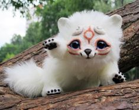
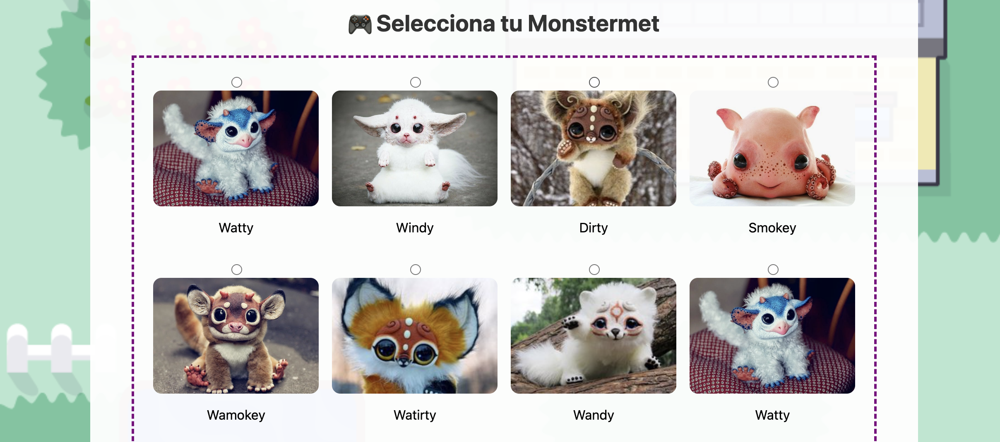
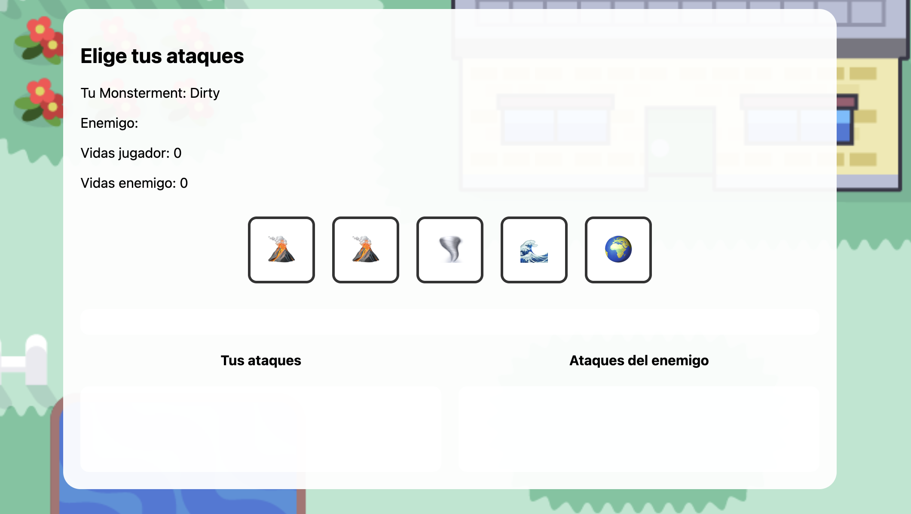

# 🎮 Monsterments - Juego de Batalla Multijugador

Un juego de batalla por turnos en tiempo real donde seleccionas tu Monsterment favorito y compites contra otros jugadores en un mapa interactivo.



## 🌟 Características

- **7 Monsterments únicos** para elegir, cada uno con habilidades especiales
- **Modo multijugador en tiempo real** - juega contra otros jugadores
- **Sistema de combate por turnos** con 4 tipos de ataques elementales
- **Mapa interactivo** donde puedes moverte libremente
- **Detección de colisiones** para iniciar batallas automáticamente
- **Interfaz responsive** que se adapta a diferentes tamaños de pantalla
- **Animaciones fluidas** y diseño moderno

## 🎯 Monsterments Disponibles

| Monster | Elemento Principal | Habilidades |
|---------|-------------------|-------------|
| 🌊 **Watty** | Agua | Especialista en ataques acuáticos |
| 🌪️ **Windy** | Aire | Domina los vientos |
| 🌍 **Dirty** | Tierra | Maestro de la tierra |
| 🔥 **Smokey** | Fuego | Control del fuego |
| 💧🔥 **Wamokey** | Agua/Fuego | Híbrido elemental |
| 🌊🌍 **Watirty** | Agua/Tierra | Combinación acuática-terrestre |
| 🌪️🌊 **Wandy** | Aire/Agua | Fusión de viento y agua |

## 🕹️ Cómo Jugar

### Inicio del Juego

1. **Selecciona tu Monsterment** - Elige entre los 7 monsters disponibles
2. **Explora el mapa** - Usa las flechas del teclado (↑ ↓ ← →) para moverte
3. **Encuentra un oponente** - Muévete hasta chocar con otro jugador
4. **¡Batalla!** - Selecciona 5 ataques estratégicamente

### Sistema de Combate

Cada monster tiene acceso a 5 ataques de diferentes elementos:

- 🔥 **FUEGO** - Fuerte contra Aire
- 💧 **AGUA** - Fuerte contra Tierra  
- 🌪️ **AIRE** - Fuerte contra Fuego
- 🌍 **TIERRA** - Fuerte contra Agua

**Mecánica:**
- Selecciona 5 ataques en el orden que prefieras
- Los ataques se comparan uno a uno con tu oponente
- Ganas puntos por cada ataque victorioso
- El jugador con más victorias gana la batalla

### Controles

- **↑** - Mover arriba
- **↓** - Mover abajo
- **←** - Mover izquierda
- **→** - Mover derecha
- **Click** - Seleccionar ataques

## 🛠️ Tecnologías Utilizadas

### Frontend
- **HTML5** - Estructura y Canvas para el mapa
- **CSS3** - Estilos modernos y responsive design
- **JavaScript (Vanilla)** - Lógica del juego y manipulación del DOM

### Backend
- **Node.js** - Servidor del juego
- **Express.js** - Framework web
- **CORS** - Habilitación de peticiones cross-origin

### Características Técnicas
- Sistema de colisiones en Canvas
- Sistema de coordenadas 2D para posicionamiento

## 📦 Instalación

### Requisitos Previos

- Node.js (v14 o superior)
- npm (Node Package Manager)
- Navegador web moderno

### Pasos de Instalación

1. **Clona el repositorio**
```bash
git clone https://github.com/tu-usuario/monsterments.git
cd monsterments
```

2. **Instala las dependencias**
```bash
npm install
```

3. **Inicia el servidor**
```bash
node server.js
```

4. **Abre el juego**
- Opción 1: Abre `index.html` con Live Server (VSCode)
- Opción 2: Accede a `http://localhost:5500/index.html`

5. **Juega multijugador**
- Abre múltiples pestañas del navegador
- Cada pestaña es un jugador diferente

## 📁 Estructura del Proyecto

```
monsterments/
│
├── index.html              # Página principal del juego
├── MONSTERMENTS.js         # Lógica principal del juego
├── server.js               # Servidor Node.js
├── package.json            # Dependencias del proyecto
│
├── imagenes/               # Assets del juego
│   ├── Watty.jpg
│   ├── Windy.jpg
│   ├── Dirty.jpg
│   ├── Smokey.jpg
│   ├── Wamokey.jpg
│   ├── Watirty.jpg
│   ├── Wandy.jpg
│   └── Monstermap.png
│
└── README.md               # Este archivo
```

## 🎨 Capturas de Pantalla

### Selección de Monster
, 

*Elige tu Monsterment favorito entre 7 opciones únicas*

### Mapa de Juego

*Explora el mapa y busca oponentes*

### Mapa de Batalla

*Sistema de combate por turnos con elementos*

## 🚀 Características Futuras

- [ ] Sistema de niveles y experiencia
- [ ] Más Monsterments con habilidades únicas
- [ ] Chat en tiempo real entre jugadores
- [ ] Torneo y ranking global
- [ ] Efectos de sonido y música
- [ ] Animaciones de ataques
- [ ] Sistema de guardado de progreso
- [ ] Modo historia para un jugador

## 🐛 Problemas Conocidos

- Las imágenes deben estar en formato `.jpg` para el funcionamiento correcto
- El servidor debe estar corriendo para el modo multijugador
- Se requieren al menos 2 jugadores para iniciar una batalla

## 🤝 Contribuciones

¡Las contribuciones son bienvenidas! Si quieres mejorar el juego:

1. Fork el proyecto
2. Crea una rama para tu feature (`git checkout -b feature/AmazingFeature`)
3. Commit tus cambios (`git commit -m 'Add some AmazingFeature'`)
4. Push a la rama (`git push origin feature/AmazingFeature`)
5. Abre un Pull Request

## 📝 Lo que Aprendí

Durante el desarrollo de este proyecto aprendí:

### JavaScript
- ✅ Manipulación del DOM
- ✅ Event Listeners y manejo de eventos de teclado
- ✅ Canvas API para gráficos 2D
- ✅ Fetch API y peticiones HTTP
- ✅ Programación Orientada a Objetos (Clases)
- ✅ Sistemas de colisión
- ✅ SetInterval y animaciones

### HTML5
- ✅ Estructura semántica
- ✅ Canvas para juegos
- ✅ Formularios interactivos

### CSS3
- ✅ Flexbox 
- ✅ Animaciones y transiciones
- ✅ Diseño responsive
- ✅ Estilos modernos 

### Node.js & Backend
- ✅ Creación de servidor con Express
- ✅ Manejo de rutas y endpoints
- ✅ CORS y peticiones cross-origin
- ✅ Arquitectura cliente-servidor

### Desarrollo de Juegos
- ✅ Game loop y actualización de frames
- ✅ Sistema de coordenadas 2D
- ✅ Detección de colisiones
- ✅ Estados del juego
- ✅ Lógica de combate por turnos


## 👤 Autor

**Tu Nombre**
- GitHub: [@KlauGM](https://github.com/KlauGM)
- LinkedIn: [Claudia GM](www.linkedin.com/in/claudia-gm-700360269)

## 🙏 Agradecimientos

- Inspirado en juegos clásicos de Pokemon y Monster Hunter
- Assets de imágenes creados con AI
- Comunidad Platzi de desarrolladores por el apoyo

---

⭐ Si te gustó el proyecto, ¡deja una estrella en GitHub!

🎮 **¡Diviértete jugando Monsterments!**
